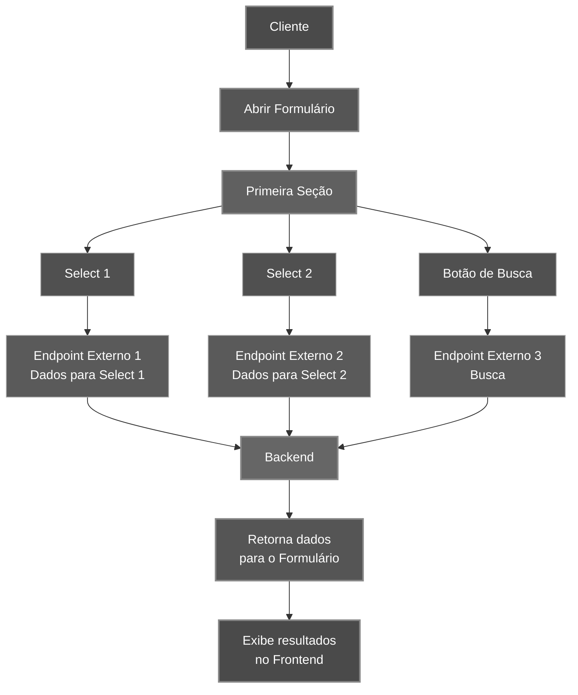

# Fluxograma do Formulário do Cliente

```mermaid
flowchart TD
    A[Cliente] --> B[Abrir Formulário]
    B --> C[Primeira Seção]
    
    C --> D[Select 1]
    C --> E[Select 2]
    C --> F[Botão de Busca]
    
    D --> G[Endpoint Externo 1<br/>Dados para Select 1]
    E --> H[Endpoint Externo 2<br/>Dados para Select 2]
    F --> I[Endpoint Externo 3<br/>Busca]
    
    G --> J[Backend]
    H --> J
    I --> J
    
    J --> K[Retorna dados<br/>para o Formulário]
    K --> L[Exibe resultados<br/>no Frontend]
    
    style A fill:#4a4a4a,stroke:#888,stroke-width:2px,color:#fff
    style B fill:#555,stroke:#888,stroke-width:2px,color:#fff
    style C fill:#606060,stroke:#888,stroke-width:2px,color:#fff
    style D fill:#505050,stroke:#999,stroke-width:1px,color:#fff
    style E fill:#505050,stroke:#999,stroke-width:1px,color:#fff
    style F fill:#505050,stroke:#999,stroke-width:1px,color:#fff
    style G fill:#5a5a5a,stroke:#aaa,stroke-width:1px,color:#fff
    style H fill:#5a5a5a,stroke:#aaa,stroke-width:1px,color:#fff
    style I fill:#5a5a5a,stroke:#aaa,stroke-width:1px,color:#fff
    style J fill:#666,stroke:#888,stroke-width:2px,color:#fff
    style K fill:#555,stroke:#888,stroke-width:2px,color:#fff
    style L fill:#4a4a4a,stroke:#888,stroke-width:2px,color:#fff
```
